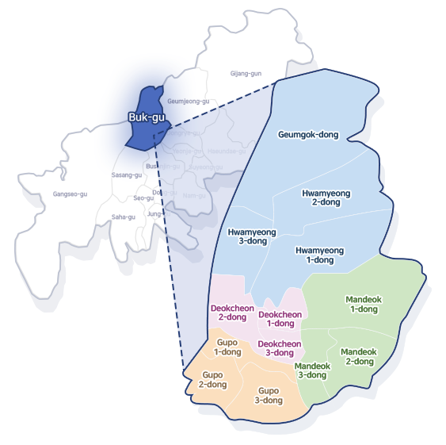

# CNU-Dataset

## This dataset contains:
`['date', 'temperatures(C)', 'humidity(%)', 'pressure(hPa)', 'energy(kWh)']`
### of 6 buildings in CNU Gwangju Campus, South Korea.

| Korean name | English name                       | Position |
|-------------|------------------------------------|----------|
| 진리관         | Truth building                     | B06      |
| 공대3호관       | Engineering department building 3  | C15      |
| 농생대4호관      | Agricultural department building 4 | A08      |
| 공대7호관       | Engineering department building 7  | C14      |
| 대학본부        | University headquarter             | D18      |
| 농생대3호관      | Agricultural department building 3 | A06      |

### The data is collected from 2018-01-01 to 2019-12-31. Example of the data is shown below.

#### Visualization of the data ('temperatures(C)', 'humidity(%)', 'energy(kWh)') in building 7 is shown below.
