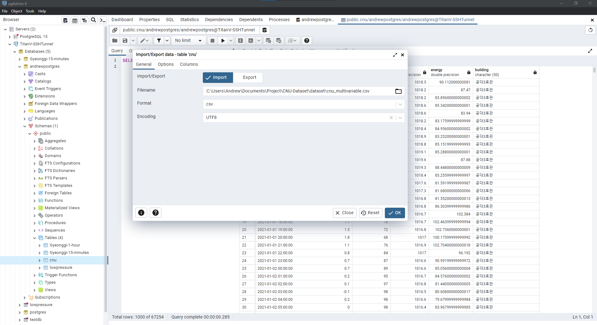

## Working with PostgreSQL Database

## Unitest all files into a file
- Check `./dataset/combine_data.ipynb`

## Import `csv` file into `PostgreSQL`
- Create the database. Check `import_csv.sql`
- Using **pbAdmin4** to import the `csv` file
